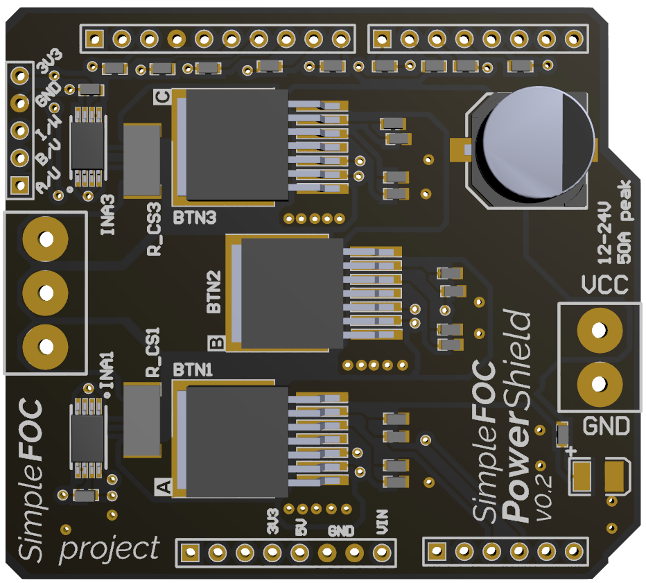
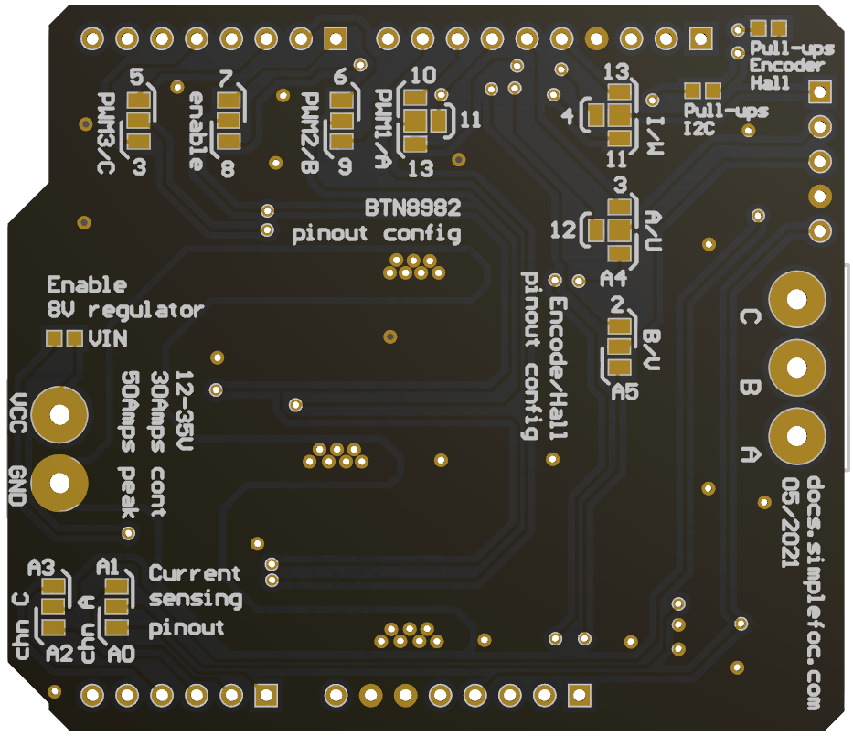
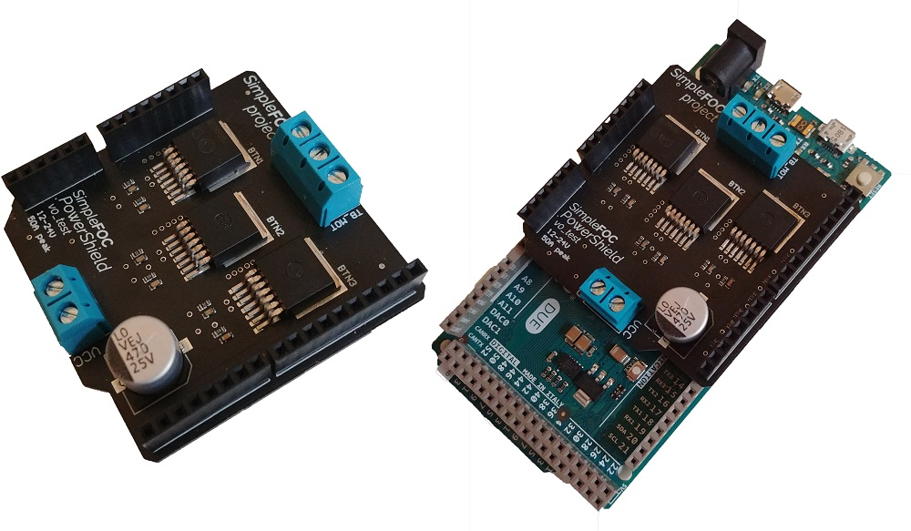

# Arduino *Simple**FOC** PowerShield* *v0.1* 
A powerful arduino shield for running BLDC motors using the FOC algorithm. This board is based on the [BTN8982](https://www.infineon.com/dgdl/Infineon-BTN8982TA-DS-v01_00-EN.pdf?fileId=db3a30433fa9412f013fbe32289b7c17) half bridges and can support currents up to 30 Amps continuos and 50Amps peak. Making it a board that can run virtually any BLDC motor.

### Features
- **Plug & play**: In combination with Arduino *Simple**FOC**library* - [github](https://github.com/simplefoc/Arduino-FOC)
- **Low-cost**: Price of €20-€25 -  **Will be available soon in the [shop](https://simplefoc.com/shop)!**
- **High-side current sensing**: - not yet supported by *Simple**FOC**library*
- **Max power >500W**: max current 30A, power-supply 24V
- **Arduino headers**: Arduino UNO, Arduino MEGA, STM32 Nucleo boards, Aruidno DUE...
- **Small size**: 55mm x 55mm
- **Open Source**: Fully available fabrication files  
    - If never done it before, dee a similar guide for *Simple**FOC**Shueld*:  [how to make it yourself](https://docs.simplefoc.com/arduino_simplefoc_shield_fabrication)
#### Future features
- **Stackable**: running 2 motors in the same time
- **Encoder/Hall sensors interface**: Integrated 3.3kΩ pullups (configurable)
- **I2C interface**: Integrated 4.7kΩ pullups (configurable)
- **Configurable pinout**: Hardware configuration - soldering connections

